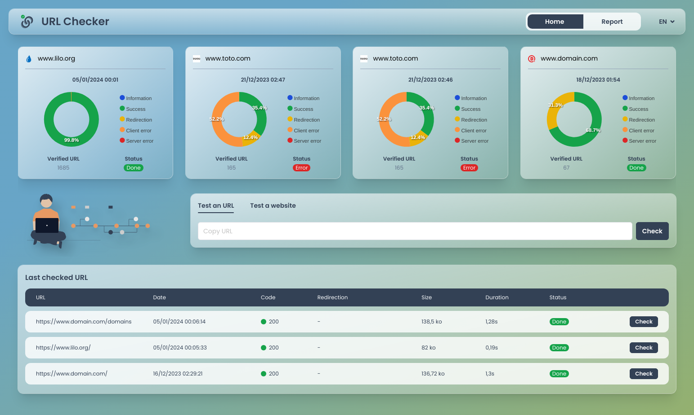
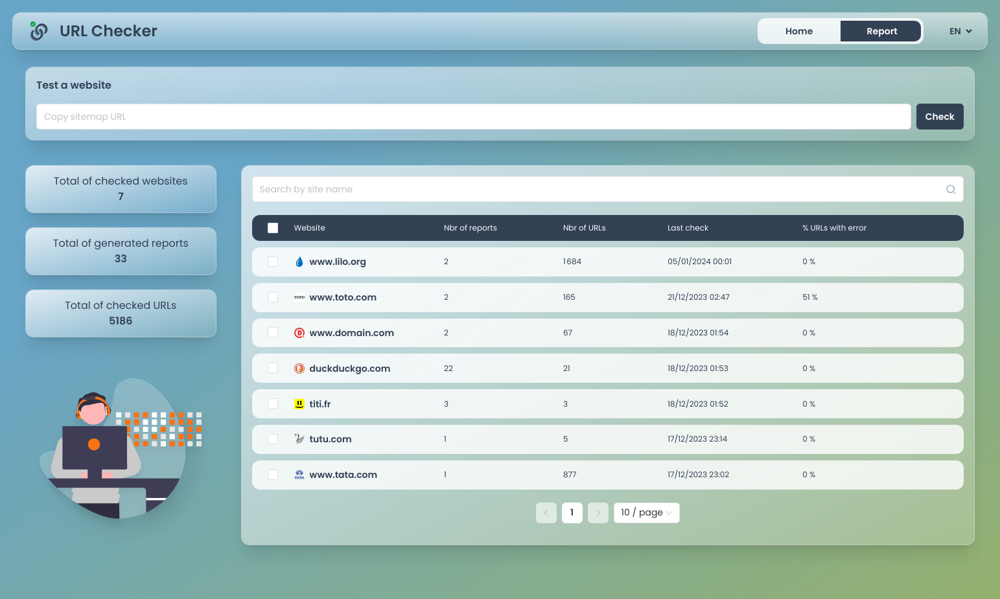
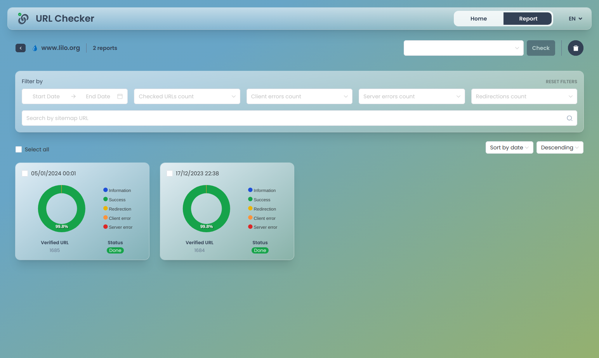
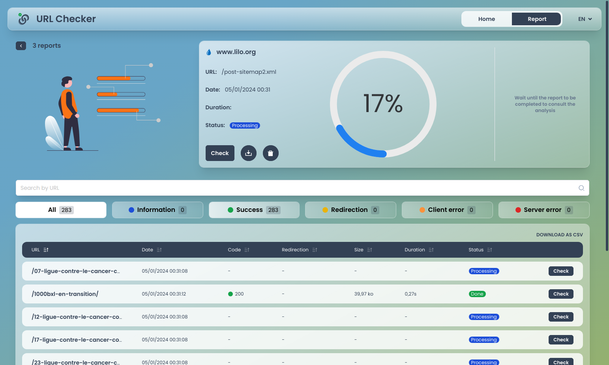
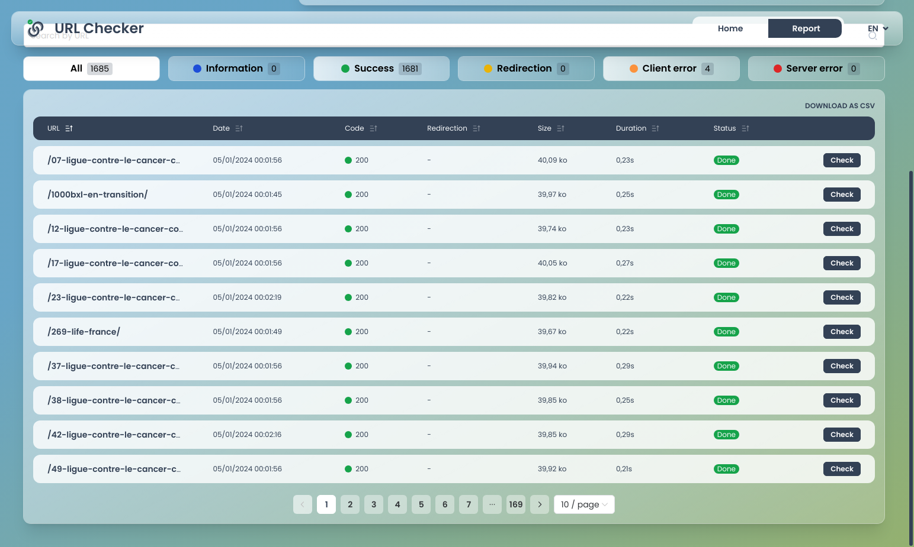
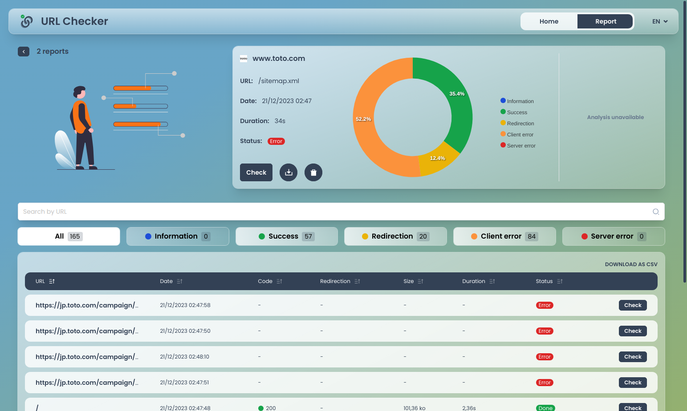
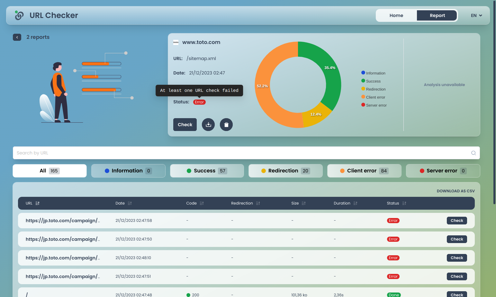
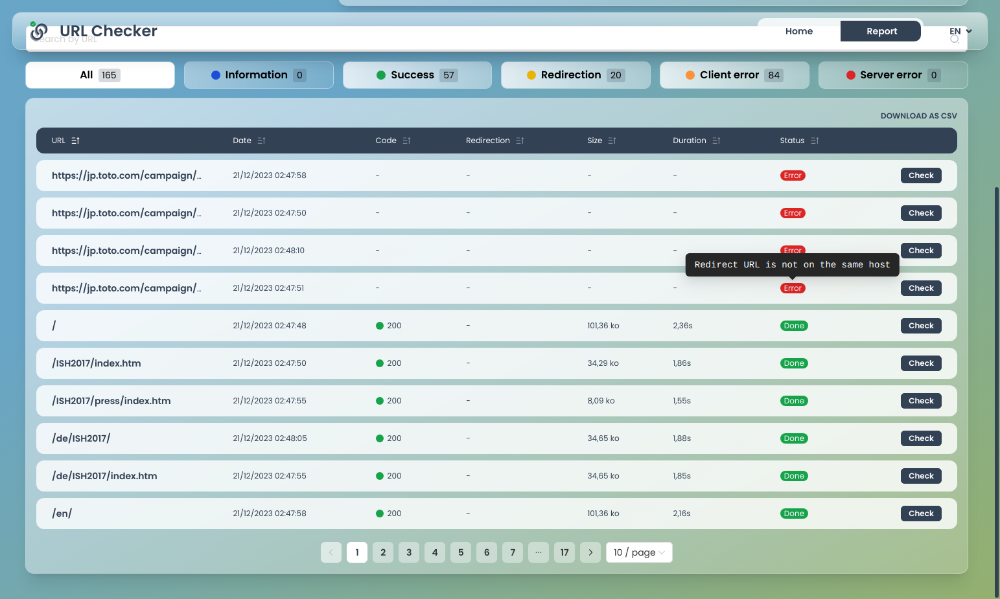

#  URL Checker

URL Checker is a **self-hosted** solution which can help you to **detect** any **unwanted changes in** the (images) **sitemap**(s) of your websites.

## Features

✅ Check every URLs present in a sitemap\
✅ Parallelized checks 🚀️\
✅ Support both [regular](https://www.sitemaps.org/protocol.html) and [images](https://developers.google.com/search/docs/crawling-indexing/sitemaps/image-sitemaps) sitemap (except [sitemap index](https://www.sitemaps.org/protocol.html#index))\
✅ Build a report with stats, pie chart, URLs list...\
✅ Compare with previous report\
✅ Paginated, sortable and filterable URLs list\
✅ Follow website internal redirections\
✅ Export all URL in CSV format\
✅ Group reports by website\
✅ Quickly check a specific URL\
✅ Real time changes propagation across all users\
✅ Documented GraphQL API\
✅ Translated in English and French\
✅ Easy setup

## Screenshots

### Navigation

|  |  |  |
| :-----------------------------------------------------------------------: | :-----------------------------------------------------------------------: | :------------------------------------------------------------------------------: |
|                               *Homepage*                               |                               *Websites*                               |                               *Website reports*                               |

### Report details

|  |  |  |
| :--------------------------------------------------------------------------------: | :----------------------------------------------------------------------------: | :----------------------------------------------------------------------------: |
|                               *Report details (1)*                               |                             *Report details (2)*                             |                             *Report details (3)*                             |

### Report details (invalid sitemap)

|  |  |  |
| :-----------------------------------------------------------------------------: | :-----------------------------------------------------------------------------: | :-----------------------------------------------------------------------------: |
|                             *Report details (1)*                             |                             *Report details (2)*                             |                             *Report details (3)*                             |

## Setup

### Prerequisites

Both API and Webapp use [pnpm](https://pnpm.io) as package manager so you have to [install it](https://pnpm.io/installation) first.

### Installation

Depending of your system, instructions may need to be slightly adapted but the basics are:

* clone the `master` branch of this repository using [git](https://git-scm.com/): `git clone -b master`
* follow [API installation instructions](./api)
* follow [Webapp installation instructions](./webapp)

## Sponsors

This project is gracefully sponsored by:

\
[Le Guide du Patrimoine](https://www.leguidedupatrimoine.com)

## Contribution

Please note that this project is released with a [Contributor Code of Conduct](CODE-OF-CONDUCT.md). By participating in this project you agree to abide by its terms.

## License

This project is licensed under [GPLv3 or later](./LICENSE) with [Commons Clause](https://commonsclause.com/).
